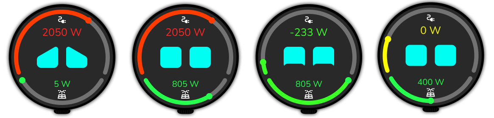

# Energy Monitor ESPHome

## Description

This project uses an ESP32 with a round display ([ESP32-C3](https://fr.aliexpress.com/item/1005006194839720.html), model esp32-2424s012) to show real-time household power consumption (in Watts) and solar panel production, with data retrieved from Home Assistant. To make the interface more engaging, animated robot eyes are displayed in the center; their random blinking brings the application to life. The ESP32 is wall-mounted, allowing anyone to check energy consumption and production at a glance. The final result can be seen in the "Final Result" section below.

## How to

This code is part of an ESPHome project for energy monitoring.

To generate a random 32-byte API encryption key in base64 for ESPHome, run this command in your terminal:

```sh
openssl rand -base64 32
```
Copy the output and use it as the value for `api.encryption.key` in your YAML file.

To launch the project, use the following command:

```sh
esphome run energyMonitorESPHOME-esp32-2424s012.yaml
```

This command compiles the `energyMonitorESPHOME-esp32-2424s012.yaml` configuration and uploads it to your ESP32 device.

## Project Overview

This project aims to visualize household energy consumption and solar energy production using two gauges. The interface is designed to be user-friendly and engaging, featuring animated robot eyes that express emotions based on energy usage:

- **High consumption:** The robot appears upset.
- **Low or negative consumption:** The robot looks extremely happy.

This visual feedback helps users quickly understand their energy usage patterns and encourages efficient energy consumption.

## Prototype

Below is a mockup of the application's interface:



## Final Result

Below are animations of the final result:

**Blink Animation:**  


**Value Animation:**  


## Legal Notice

This project is provided as an open-source example and is not affiliated with any commercial brand.  
Use of the hardware, images, or code is at your own risk.  
All trademarks and logos mentioned belong to their respective owners.  
No personal data is collected by this project.  
For any questions or content removal requests, please contact the repository author.